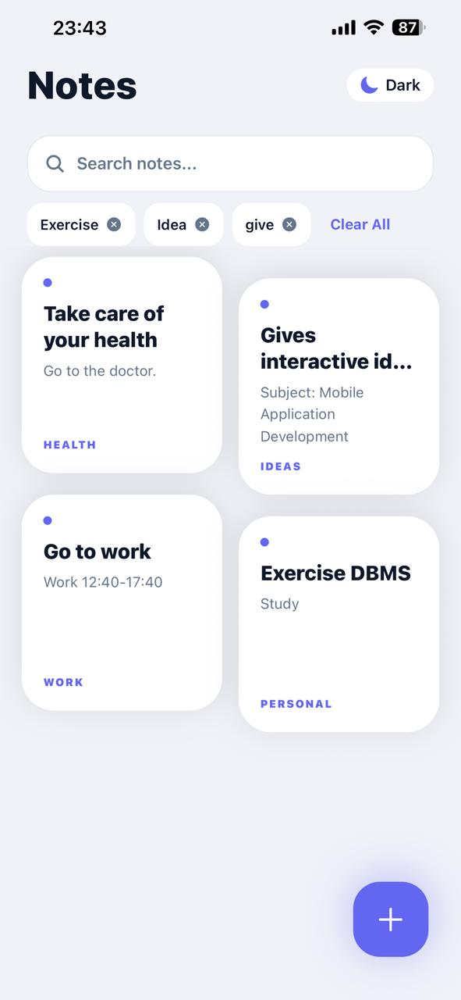
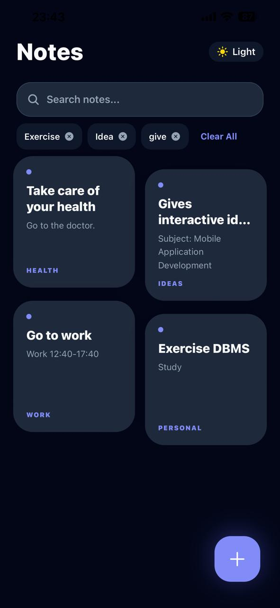
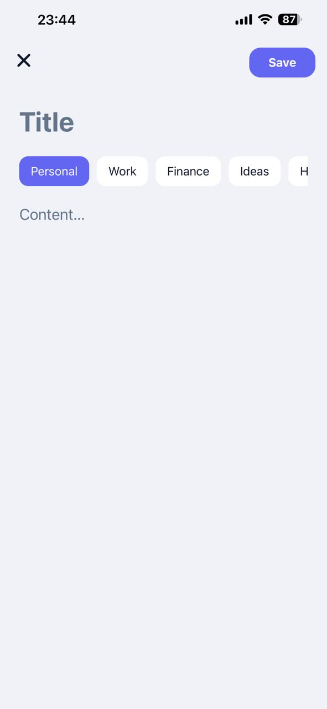

# 📝 My Workspace - Notes App

A modern, high-performance note-taking application built with **React Native (Expo)**. This project demonstrates advanced **Local Data Persistence** using AsyncStorage, clean architecture, and AI-assisted development practices.

## 📱 App Preview

| Home Light Mode | Home Dark Mode | Create New Note | Edit & Delete |
| :---: | :---: | :---: | :---: |
|  |  |  |  |

> **Note:** To see the images above, please place your screenshots in a folder named `screenshots` in the root directory and name them `home.png`, `create.png`, and `darkmode.png`.

## 🚀 Key Features

-   **Full CRUD Functionality**: Create, Read, Update, and Delete notes seamlessly.
-   **Asynchronous Local Storage**: Powered by `@react-native-async-storage/async-storage` to ensure data persists even after the app is closed.
-   **Bento Grid UI**: A premium, dynamic grid layout that organizes notes beautifully on the home screen.
-   **Categorization System**: Organize your thoughts using predefined categories: *Personal, Work, Finance, Ideas, and Health*.
-   **Search & Persistence**: Real-time keyword search with a persistent "Recent Searches" history feature.
-   **Dark Mode Support**: A fully integrated theme provider that saves your visual preferences locally.
-   **Smooth Navigation**: Uses React Navigation with horizontal slide interpolations for a premium feel.

## 🛠 Tech Stack

-   **Framework**: React Native (Expo)
-   **Storage**: AsyncStorage (Local Key-Value Storage)
-   **Navigation**: React Navigation (Stack)
-   **State Management**: React Context API (Global Theme & Settings)
-   **Icons**: Expo Vector Icons (Ionicons)

## 📁 Project Architecture

The project follows the modular structure recommended for scalable mobile applications:

-   `src/components/`: Reusable UI components like the dynamic `Header.js`.
-   `src/context/`: Global state management via `ThemeContext.js`.
-   `src/screens/`: Main application logic (`HomeScreen`, `CreateNote`, `EditNote`).
-   `src/storage/`: Centralized `notesStorage.js` handling all data serialization (JSON) and AsyncStorage logic.

## 🤖 AI Usage Report

In line with the course requirements, AI tools (ChatGPT/Copilot) were utilized to optimize the development workflow:

1.  **Boilerplate Generation**: Used AI to quickly scaffold the initial component structures and folder hierarchy.
2.  **Logic Refactoring**: AI assisted in optimizing the CRUD functions in `notesStorage.js` to handle asynchronous operations safely.
3.  **Data Modeling**: Helped design the JSON schema for notes: `{ id, title, content, date, category }`.
4.  **UI/UX Refinement**: AI helped generate the StyleSheet logic for the Bento-style grid and dynamic theme switching.

**Key Prompts Used:**

-   *"Create a reusable storage utility for React Native using AsyncStorage for a notes app."*
-   *"Help me refactor a React Context to persist Dark Mode state using AsyncStorage."*
-   *"Design a Bento-style grid for a FlatList in React Native."*

## 📥 Installation & Setup

1.  **Clone the repository**
2.  **Install dependencies**:
    
    ```bash
    npm install
    ```
    
3.  **Launch the application**:
    
    ```bash
    npx expo start
    ```
    

---

**Developer:** Rinesa Bislimi **Course:** Mobile App Development  
**Instructor:** Agon Bajgora
